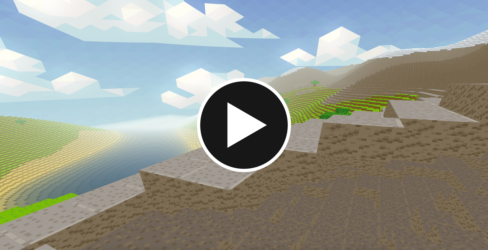
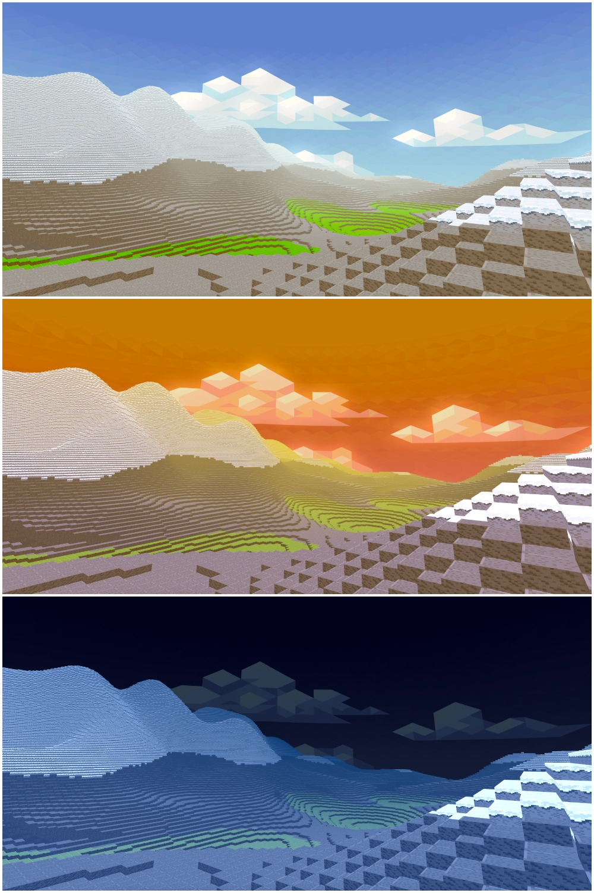
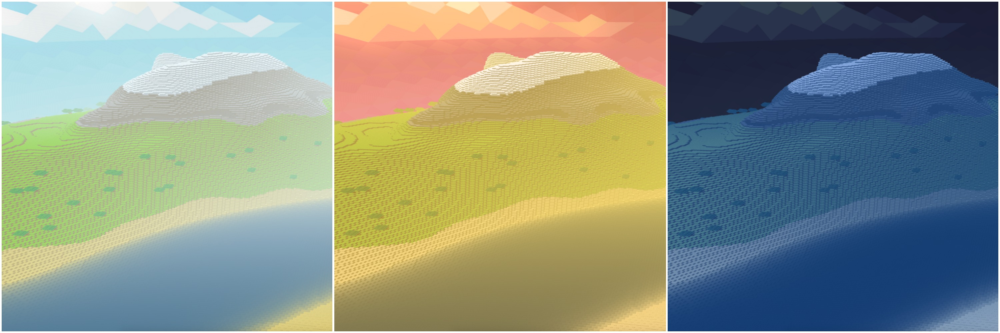
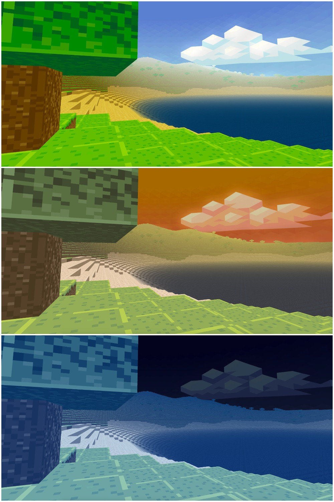
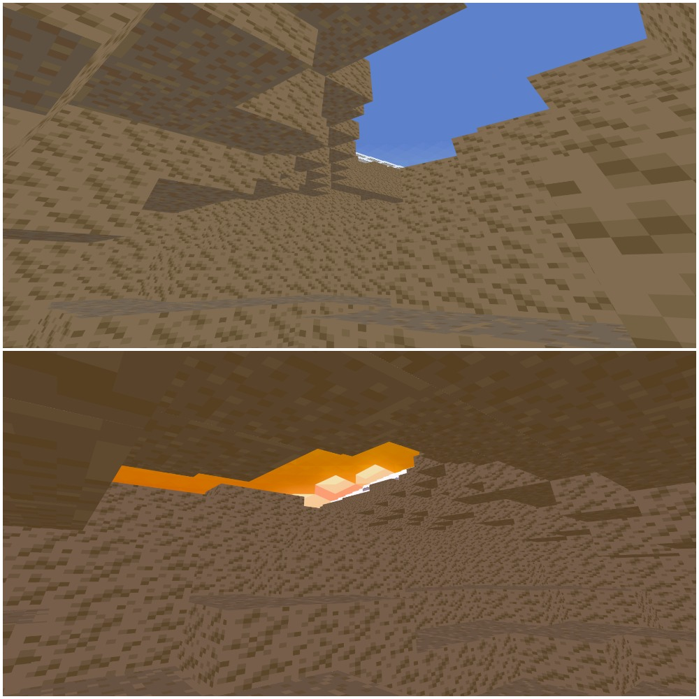

# Voxel Landscape Engine

Minecraft style voxel terrain engine made from scratch using OpenGL in C++.

## Showcase Video
[](https://www.youtube.com/watch?v=StTqXEQ2l-Y "Voxel Landscape Engine")

## Screenshots









## Features

* Snow, rock, grass and sand block type
* Transparent water
* Trees
* Caves and overhangs
* Different player modes
* Day-Night shift
* Runs at >~ 50 FPS in full screen mode on iMac

## Comiling and Running

Run `make` to compile. Needed libraries will be downloaded and an executable will be created.

Run with:
```
./Vox [-r | seed(integer)]
```
Where the terrain will be generated deterministically based on the seed given.
`-r` option will use random seed (based on current time)

## Runtime Controls

`Mouse movement` Controls the angle/direction of the camera

`-WASD` Move camera (exact movement based on the mode below)

`-1` Glider mode (fly directions according to mouse angle)

`-2` Run mode (run on the ground with 'WASD' keys and mouse)

`-3` Classic minecraft flying mode (in addition to WASD, we have `Space` for up and `Shift` for down)

`-4` Snail mode (moves one grid per second on the ground, able to enter caves)
